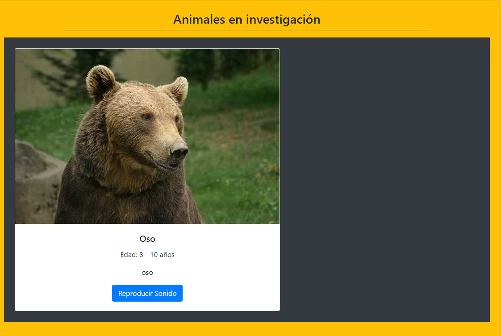

- [Desafío de Programación Avanzada en JavaScript](#desafío-de-programación-avanzada-en-javascript)
  - [Requerimientos](#requerimientos)
  - [Pasos](#pasos)
  - [Resultado](#resultado)

 # Desafío de Programación Avanzada en JavaScript

- Descripción

En Australia se están realizando investigaciones con algunos animales salvajes y necesitan
crear un sitio web que permita registrar los comentarios de los investigadores. En esta prueba
deberás crear una aplicación web que permita agregar en una tabla los animales en
investigación, utilizando el paradigma POO para la creación de las instancias que representen
los diferentes animales con sus atributos y métodos.

  ---

## Requerimientos

1. Crear las clases representadas en el diagrama implementando la herencia indicada.

2. Crear las instancias de las clases utilizando los datos del formulario.

3. Realizar una consulta asíncrona utilizando una función async/await para obtener las
imágenes correspondientes a los animales.

4. Realizar por lo menos una función autoejecutable IIFE.
   
5. Dividir el código en módulos
   
6. Utilizar la manipulación del DOM para mostrar en la tabla los animales registrados con
el formulario.

7. Validar que el usuario haya asignado todos los datos del animal antes de que éste sea
agregado a la tabla.

8. Devolver el formulario en un estado inicial luego de registrar a cada animal.
  
9. Programar la interacción del botón de audio, en donde deberás reproducir el sonido
del animal en el sitio web.

10.  Mostrar el detalle de cada animal en una ventana modal al ser presionada su imagen. 

   ---

## Pasos

1. Se crea la estructura (assets que  Contiene las carpetas con contenido del proyecto, imagenes, sonidos), se agrega la carpeta Dominio que Contiene las clases de los tipos de animales.

---

## Resultado

